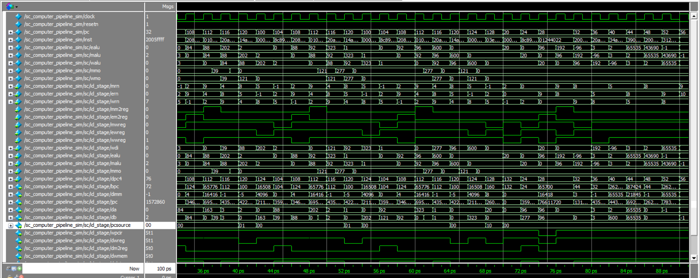
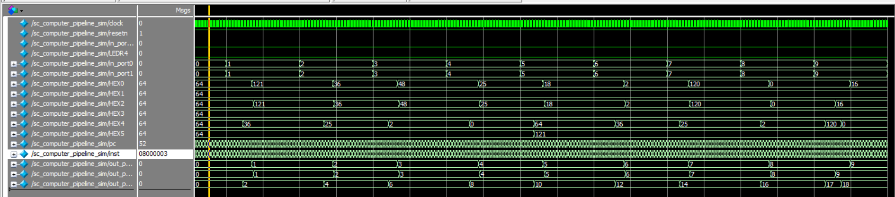
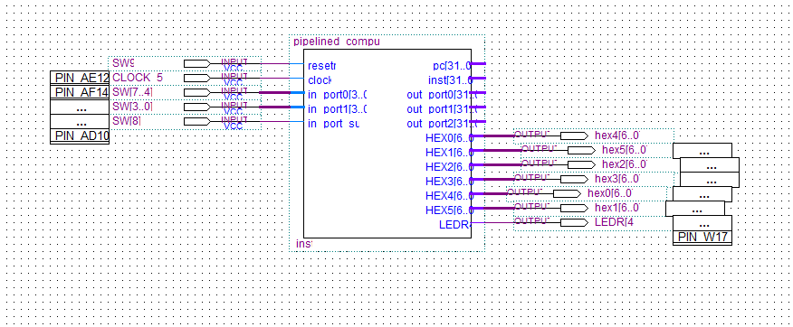

[TOC]


# 5段流水CPU设计


## 水青冈


##  1. 实验目的


1. **理解计算机指令流水线的协调工作原理，初步掌握流水线的设计和实现原理。**
2. **深刻理解流水线寄存器在流水线实现中所起的重要作用。**
3. **理解和掌握流水段的划分、设计原理及其实现方法原理。**
4. **掌握运算器、寄存器堆、存储器、控制器在流水工作方式下，有别于实验一的设计和实现方法。**
5. **掌握流水方式下，通过I/O端口与外部设备进行信息交互的方法。**


## 2. 实验所用仪器及元器件

​	**DE1-SOC实验板**                                                                                                       **1套**


## 3. 实验任务


###  3.1 实验内容和任务


1. **采用Verilog在quartusⅡ中实现基本的具有20条MIPS指令的5段流水CPU设计。**
2. **利用实验提供的标准测试程序代码，完成仿真测试。**
3. **采用I/O统一编址方式，即将输入输出的I/O地址空间，作为数据存取空间的一部分，实现CPU与外部设备的输入输出端口设计。实验中可采用高端地址。**
4. **利用设计的I/O端口，通过lw指令，输入DE2实验板上的按键等输入设备信息。即将外部设备状态，读到CPU内部寄存器。**
5. **利用设计的I/O端口，通过sw指令，输出对DE2实验板上的LED灯等输出设备的控制信号（或数据信息）。即将对外部设备的控制数据，从CPU内部的寄存器，写入到外部设备的相应控制寄存器（或可直接连接至外部设备的控制输入信号）。**
6. **利用自己编写的程序代码，在自己设计的CPU上，实现对板载输入开关或按键的状态输入，并将判别或处理结果，利用板载LED灯或7段LED数码管显示出来。**
7. **例如，将一路4bit二进制输入与另一路4bit二进制输入相加，利用两组分别2个LED数码管以10进制形式显示“被加数”和“加数”，另外一组LED数码管以10进制形式显示“和”等。（具体任务形式不做严格规定，同学可自由创意）。**
8. **在实现MIPS基本20条指令的基础上，<font color="red">掌握新指令的扩展方法</font>。**
* **在实验报告中，汇报自己的设计思想和方法；并以汇编语言的形式，提供以上两种指令集（MIPS和Y86）应用功能的程序设计代码，并提供程序主要流程图。**


### 3.2 设计过程

####  3.2.1 采用Verilog在quartusⅡ中实现基本的具有20条MIPS指令的5段流水CPU设计。

&emsp;&emsp;王赓老师已经给出了顶层设计，同时还有上次的代码可以使用，我需要做的工作就是依次把顶层设计中的所有模块都进行实现。流水线和单周期不同的地方就在于对于冒险的处理，尤其是数据冒险和控制冒险，对于数据冒险来说，主要是弄清楚如何正确设置**<font color="red">fwda</font>**和**<font color="red">fwdb</font>**的值，以及**<font color="red">wpcir</font>**的值（低电平有效）。而对于控制冒险，则默认采用了延迟转移槽的方法，即紧随其后的语句一定会被执行。另外需要注意的地方在于，用什么时钟去控制寄存器对，指令ROM和数据RAM的读写。

##### 3.2.1.1 pipepc的实现

&emsp;&emsp;对于pipepc来说，它的作用是提供下一条指令的PC值，即在上升沿到来时，更新PC值。如果resetn和wpcir都为1的话，那么PC值更新为输入的npc，如果resetn有效即为0，那么PC值更新为-4，如果resetn无效即为1而wpcir有效即为0，那么PC值不变（即由于lw导致的数据冒险，需要插入气泡）。

```verilog
module pipepc( npc,wpcir,clock,resetn,pc );
	input  [31:0] npc;
   input         clock,resetn,wpcir;
   output [31:0] pc;
   reg 	 [31:0] pc;
   always @ (negedge resetn or posedge clock)
      if (resetn == 0)   // 清零
		begin
          pc <= -4;
      end 
		else 
		if (wpcir != 0)  
		begin
          pc <= npc;  // 更新
      end
endmodule
```


##### 3.2.1.2 pipeif的实现

&emsp;&emsp;pipeif的主要功能是，从指令ROM中取指令，同时设置下一条指令的PC值npc，pc4即原PC值+4，bpc即beq和bne对应的pc值，da即jr指令中读取的寄存器的值，jpc即j和jal指令对应的pc值。特别地，对于指令ROM，它对应的时钟mem_clock是clock的反向，也就是说，当clock从1跳变到0时，mem_clock从0跳变到1，读取出指令，使PC值有半个时钟周期的时间稳定下来，稳定后，再读取指令。

```verilog
module pipeif( pcsource,pc,bpc,da,jpc,npc,pc4,ins,mem_clock );
	input  [1:0]  pcsource;
	input			  mem_clock;
	input  [31:0] pc, bpc, jpc, da;
	output [31:0] npc, pc4, ins;
	
	wire	 [31:0] npc, pc4, ins;
	
	mux4x32 npc_mux( pc4, bpc, da, jpc, pcsource, npc ); // 下一个pc值
	
	assign pc4 = pc + 4;
	
	sc_instmem imem ( pc, ins, mem_clock );  //mem_clock是clock的反向
	
endmodule
```


##### 3.2.1.3 pipeir的实现

&emsp;&emsp;段间寄存器pipeir的功能主要是输出dpc4和inst，当resetn有效时，dpc4设置为-4，而inst置0，即sll \$0,\$0,0。当resetn无效，而wpcir有效即为0时，值不变。

```verilog
module pipeir( pc4, ins, wpcir, clock, resetn, dpc4, inst );
	input  [31:0]  pc4, ins;
	input          wpcir, clock, resetn;
	output [31:0]  dpc4, inst;
	
	reg    [31:0]  dpc4, inst;
	
	always @(posedge clock or negedge resetn)
	begin
		if (resetn == 0)  //清零 
		begin
			dpc4 <= 0;
			inst <= 0;  //  指令清0实际上是sll $0,$0,0
		end
		else 
		if (wpcir != 0)
		begin
			dpc4 <= pc4;  // 实现数据的传递
			inst <= ins;
		end
	end	
endmodule
```


##### 3.2.1.4 pipeid的实现

&emsp;&emsp;pipeid是核心模块，它负责读写寄存器堆，译码并生成相应的控制信号，同时还需要进行冒险检测并作出相应的处理，所以它的输入很多，输出也很多，需要仔细的核对。其中寄存器堆regfile的实现和单周期中完全相同，故不赘述，而多路器的实现亦是如此，需要特别说明就是cu的实现。

``` verilog
module pipeid( mwreg, mrn, ern, ewreg, em2reg, mm2reg, dpc4, inst,
	wrn, wdi, ealu, malu, mmo, wwreg, clock, resetn,
	bpc, jpc, pcsource, wpcir, dwreg, dm2reg, dwmem, daluc,
	daluimm, da, db, dimm, drn, dshift, djal );
	
	input  [4:0]  mrn, ern, wrn;
	input			  mm2reg, em2reg, mwreg, ewreg, wwreg, clock, resetn;
	input  [31:0] inst, wdi, ealu, malu, mmo, dpc4;
	output [31:0] bpc, dimm, jpc, da, db;
	output [1:0]  pcsource;
	output 		  wpcir, dwreg, dm2reg, dwmem, daluimm, dshift, djal;
	output [3:0]  daluc;
	output [4:0]  drn;
	
	wire   [31:0] q1, q2, da, db;
	wire	 [1:0]  fwda, fwdb;
	wire 			  rsrtequ = (da == db);
	wire          regrt, sext;
	wire          e = sext & inst[15];
	wire   [31:0] dimm = {{16{e}}, inst[15:0]};
	wire   [31:0] jpc = {dpc4[31:28],inst[25:0],1'b0,1'b0};
	wire   [31:0] offset = {{14{e}},inst[15:0],1'b0,1'b0};
	wire   [31:0] bpc = dpc4 + offset;
	
	regfile rf( inst[25:21], inst[20:16], wdi, wrn, wwreg, clock, resetn, q1, q2 );  //寄存器堆
	mux4x32 da_mux( q1, ealu, malu, mmo, fwda, da ); // 四选一  可能的直通
	mux4x32 db_mux( q2, ealu, malu, mmo, fwdb, db );
	mux2x5  rn_mux( inst[15:11], inst[20:16], regrt, drn );
	sc_cu cu( inst[31:26], inst[5:0], rsrtequ, dwmem, dwreg, regrt, dm2reg, daluc, dshift, daluimm, pcsource, djal, sext, wpcir, inst[25:21], inst[20:16], mrn, mm2reg, mwreg, ern, em2reg, ewreg, fwda, fwdb );//控制单元
	
endmodule
```


###### 3.2.1.4.1 pipeid中cu的实现

cu是核心中的核心，首先它对指令进行译码，指示出当前指令是哪条指令，和单周期不同的是增加了wpcir和fwda及fwdb信号，如何设置这两个信号是本次实验的关键。对于wpcir，如果上一条指令是lw指令，且写入的寄存器号和当前指令的rs和rt相同，那么wcpir为0。注意，这样的写法可能会产生误判，比如当前指令是一条I型指令，它的rt字段是目的寄存器，而不是源操作数寄存器，这里可能会产生一条不必要的停顿，但是不影响正常执行，对速度有一定影响。对于fwda和fwdb的设置，利用嵌套的三个if语句来区分如果需要上一条指令alu的结果，如果需要前两条指令alu的结果，如果需要前两条指令数据RAM的输出。如果都不是，那么不需要直通。这种写法，也可能导致不必要的直通，但是对程序执行实际上没有影响。

```verilog
module sc_cu (op, func, rsrtequ, wmem, wreg, regrt, m2reg, aluc, shift,
              aluimm, pcsource, jal, sext, wpcir, rs, rt, mrn, mm2reg, mwreg, ern, em2reg, ewreg, fwda, fwdb);
   input  [5:0] op,func;
   input        rsrtequ, mwreg, ewreg, mm2reg, em2reg;
	input  [4:0] rs, rt, mrn, ern;
   output       wreg, regrt, jal, m2reg, shift, aluimm, sext, wmem, wpcir;
   output [3:0] aluc;
   output [1:0] pcsource, fwda, fwdb;
	reg [1:0] fwda, fwdb;
   wire r_type = ~|op;  // 是否是R型指令
	
	//该R型指令是否出现 
   wire i_add = r_type & func[5] & ~func[4] & ~func[3] &  ~func[2] & ~func[1] & ~func[0];		//100000	 
   wire i_sub = r_type & func[5] & ~func[4] & ~func[3] &~func[2] &  func[1] & ~func[0];      //100010
   wire i_and = r_type & func[5] & ~func[4] & ~func[3] &func[2] & ~func[1] & ~func[0];       //100100
   wire i_or  = r_type & func[5] & ~func[4] & ~func[3] &func[2] & ~func[1] &  func[0];       //100101
   wire i_xor = r_type & func[5] & ~func[4] & ~func[3] &func[2] &  func[1] & ~func[0];       //100110
   wire i_sll = r_type & ~func[5] & ~func[4] & ~func[3] &~func[2] & ~func[1] & ~func[0];     //000000
   wire i_srl = r_type & ~func[5] & ~func[4] & ~func[3] &~func[2] &  func[1] & ~func[0];     //000010
   wire i_sra = r_type & ~func[5] & ~func[4] & ~func[3] &~func[2] &  func[1] &  func[0];     //000011
   wire i_jr  = r_type & ~func[5] & ~func[4] &  func[3] &~func[2] & ~func[1] & ~func[0];     //001000
	
	
	//该I型指令是否出现
   wire i_addi = ~op[5] & ~op[4] &  op[3] & ~op[2] & ~op[1] & ~op[0]; //001000
   wire i_andi = ~op[5] & ~op[4] &  op[3] &  op[2] & ~op[1] & ~op[0]; //001100
   wire i_ori  = ~op[5] & ~op[4] &  op[3] &  op[2] & ~op[1] &  op[0]; //001101
   wire i_xori = ~op[5] & ~op[4] &  op[3] &  op[2] &  op[1] & ~op[0]; //001110  
   wire i_lw   =  op[5] & ~op[4] & ~op[3] & ~op[2] &  op[1] &  op[0]; //100011
   wire i_sw   =  op[5] & ~op[4] &  op[3] & ~op[2] &  op[1] &  op[0]; //101011
   wire i_beq  = ~op[5] & ~op[4] & ~op[3] &  op[2] & ~op[1] & ~op[0]; //000100
   wire i_bne  = ~op[5] & ~op[4] & ~op[3] &  op[2] & ~op[1] &  op[0]; //000101
   wire i_lui  = ~op[5] & ~op[4] &  op[3] &  op[2] &  op[1] &  op[0]; //001111
   wire i_j    = ~op[5] & ~op[4] & ~op[3] & ~op[2] &  op[1] & ~op[0]; //000010
   wire i_jal  = ~op[5] & ~op[4] & ~op[3] & ~op[2] &  op[1] &  op[0]; //000011
   
  
	assign wpcir = ~(em2reg & ( ern == rs | ern == rt ));  //lw的数据冒险  可能需要停顿 
	
	// 如果wpcir为0 那么插入气泡停顿 将所有的控制信号置0
   assign pcsource[1] = i_jr | i_j | i_jal;
   assign pcsource[0] = ( i_beq & rsrtequ ) | (i_bne & ~rsrtequ) | i_j | i_jal ;
   
   assign wreg = wpcir & (i_add | i_sub | i_and | i_or   | i_xor  |
                 i_sll | i_srl | i_sra | i_addi | i_andi |
                 i_ori | i_xori | i_lw | i_lui  | i_jal);
   
   assign aluc[3] = wpcir & i_sra;
   assign aluc[2] = wpcir & (i_sub | i_or | i_lui | i_srl | i_sra | i_ori);
   assign aluc[1] = wpcir & (i_xor | i_lui | i_sll | i_srl | i_sra | i_xori);
   assign aluc[0] = wpcir & (i_and | i_or | i_sll | i_srl | i_sra | i_andi | i_ori);
   assign shift   = wpcir & (i_sll | i_srl | i_sra);

   assign aluimm  = wpcir & (i_addi | i_andi | i_ori | i_xori | i_lw | i_sw);
   assign sext    = wpcir & (i_addi | i_lw | i_sw | i_beq | i_bne);
   assign wmem    = wpcir & i_sw;
   assign m2reg   = wpcir & i_lw;
   assign regrt   = wpcir & (i_addi | i_andi | i_ori | i_xori | i_lw | i_lui);
   assign jal     = wpcir & i_jal;
	

   	
	// fwda和fwda的设置
   always @(*)
   begin
	if(ewreg & (ern != 0) & (ern == rs) )  //将上一条指令的alu结果直通 如果上一条指令是lw的话 那么会停顿一个时钟周期 所以误直通了也无所谓
         fwda<=2'b01;
      else 
		if (mwreg & ~ mm2reg & (mrn != 0) & (mrn == rs) ) //将前两条指令的alu结果直通
            fwda<=2'b10;
         else  
            if  (mwreg & mm2reg & (mrn != 0) & (mrn == rs) )  // 将前两条指令的数据RAM的输出直通
               fwda<=2'b11;
            else 
               fwda<=2'b00;  // 无需直通 
   end


   always @(*)
   begin
      if(ewreg & (ern != 0) & (ern == rt) ) //将上一条指令的alu结果直通
         fwdb<=2'b01;
      else  
         if (mwreg & ~ mm2reg & (mrn != 0) & (mrn == rt) )  //将前两条指令的alu结果直通
            fwdb<=2'b10;
         else 
            if  (mwreg & mm2reg & (mrn != 0) & (mrn == rt) )   // 将前两条指令的数据RAM的输出直通
               fwdb<=2'b11;
            else 
               fwdb<=2'b00; // 无需直通 

   end
	
endmodule
```


##### 3.2.1.5 pipedereg的实现

&emsp;&emsp;段间寄存器pipedereg的主要功能是如果清零信号有效，那么将输出置零，否则在时钟上升沿将输入对应地赋给输出。

```verilog
module pipedereg ( dwreg, dm2reg, dwmem, daluc, daluimm, da, db, dimm, drn, dshift,
	djal, dpc4, clock, resetn, ewreg, em2reg, ewmem, ealuc, ealuimm,
	ea, eb, eimm, ern0, eshift, ejal, epc4 ); 
	input         dwreg, dm2reg, dwmem, daluimm, dshift, djal, clock, resetn;
	input  [3:0]  daluc;
	input  [31:0] dimm, da, db, dpc4;
	input  [4:0]  drn;
	output 		     ewreg, em2reg, ewmem, ealuimm, eshift, ejal; 
	output [3:0]  ealuc;
	output [31:0] eimm, ea, eb, epc4;
	output [4:0]  ern0;
	reg       		  ewreg, em2reg, ewmem, ealuimm, eshift, ejal; 
	reg    [3:0]  ealuc;
	reg    [31:0] eimm, ea, eb, epc4;
	reg    [4:0]  ern0;
	
	always @( posedge clock or negedge resetn)
	begin
		if (resetn == 0 )  //清零
		begin
			ewreg <= 0;
			em2reg <= 0;
			ewmem <= 0;
			ealuimm <= 0;
			eshift <= 0;
			ejal <= 0;
			ealuc <= 0;
			eimm <= 0;
			ea <= 0;
			eb <= 0;
			epc4 <= 0;
			ern0 <= 0;
		end
		else
		begin  
			ewreg <= dwreg;
			em2reg <= dm2reg;
			ewmem <= dwmem;
			ealuimm <= daluimm;
			eshift <= dshift;
			ejal <= djal;
			ealuc <= daluc;
			eimm <= dimm;
			ea <= da;
			eb <= db;
			epc4 <= dpc4;
			ern0 <= drn;
		end
	end
endmodule
```


##### 3.2.1.6 pipeexe的实现

&emsp;&emsp;pipeexe的主要任务就是进行算术运算，里面调用了alu模块。

```verilog
module pipeexe( ealuc, ealuimm, ea, eb, eimm, eshift, ern0, epc4, ejal, ern, ealu );
	input  [3:0]  ealuc;
	input  [31:0] ea, eb, eimm, epc4;
	input  [4:0]  ern0;
	input  		  ealuimm, eshift, ejal;
	output [31:0] ealu;
	output [4:0]  ern;
	wire   [31:0] a, b, r;
	wire   [31:0] epc8 = epc4 + 4;
	wire   [4:0]  ern = ern0 | {5{ejal}};
	mux2x32 a_mux( ea, eimm, eshift, a );
	mux2x32 b_mux( eb, eimm, ealuimm, b );
	mux2x32 ealu_mux( r, epc8, ejal, ealu );
	alu     al_unit( a, b, ealuc, r );  // alu模块
	
endmodule
```


###### 3.2.1.6.1 pipeexe中alu的实现

​     我对真值表进行了修改，将所有的x都明确为0，所以这里相应进行了修改。

``` verilog
module alu (a,b,aluc,s);
   input [31:0] a,b;
   input [3:0] aluc;
   output [31:0] s;
   reg [31:0] s;
   always @ (a or b or aluc) 
      begin                                   // event
         case (aluc)
             4'b0000: s = a + b;              //x000 ADD
             4'b0100: s = a - b;              //x100 SUB
             4'b0001: s = a & b;              //x001 AND
             4'b0101: s = a | b;              //x101 OR
             4'b0010: s = a ^ b;              //x010 XOR
             4'b0110: s = b << 16;            //x110 LUI: imm << 16bit             
             4'b0011: s = b << a;             //0011 SLL: rd <- (rt << sa)
             4'b0111: s = b >> a;             //0111 SRL: rd <- (rt >> sa) (logical)
             4'b1111: s = $signed(b) >>> a;   //1111 SRA: rd <- (rt >> sa) (arithmetic)
             default: s = 0;
         endcase      
      end      
endmodule 
```


##### 3.2.1.7 pipeemreg的实现

&emsp;&emsp;段间寄存器pipeemreg，如果清零信号有效，那么清零，否则按照相应的输入输出。

```verilog
module pipeemreg( ewreg,em2reg,ewmem,ealu,eb,ern,clock,resetn,
	mwreg,mm2reg,mwmem,malu,mb,mrn);
	input          ewreg, em2reg, ewmem, clock, resetn;
	input  [31:0]  ealu, eb;
	input  [4:0]   ern;
	output         mwreg, mm2reg, mwmem;
	output [31:0]  malu, mb;
	output [4:0]   mrn;
	reg            mwreg, mm2reg, mwmem;
	reg    [31:0]  malu, mb;
	reg    [4:0]   mrn;
	
	always @( posedge clock or negedge resetn)
	begin
		if (resetn == 0 )  // 清零
		begin
			mwreg <= 0;
			mm2reg <= 0;
			mwmem <= 0;
			malu <= 0;
			mb <= 0;
			mrn <= 0;
		end
		else
		begin
			mwreg <= ewreg;
			mm2reg <= em2reg;
			mwmem <= ewmem;
			malu <= ealu;
			mb <= eb;
			mrn <= ern;
		end
	end
endmodule
```


##### 3.2.1.8 pipemem的实现

&emsp;&emsp;pipemem的主要功能就是从数据RAM读取数据或将数据写入到数据RAM中，而sc_datamem的详情将在后面的I/O扩展部分着重介绍。

```verilog
module pipemem( resetn,mwmem, malu, mb, clock, mem_clock, mmo,in_port0,in_port1,in_port_sub,out_port0,out_port1,out_port2,LEDR4 );
	input          mwmem, clock,resetn;
	input  [31:0]  malu, mb;
	input         mem_clock,in_port_sub;
	input [3:0] in_port0,in_port1;
	output LEDR4;
	output [31:0]  mmo,out_port0,out_port1,out_port2;
	sc_datamem dmem( resetn,malu, mb, mmo, mwmem, mem_clock,in_port0,in_port1,in_port_sub,out_port0,out_port1,out_port2,LEDR4);

endmodule
```


##### 3.2.1.9 pipemwreg的实现

&emsp;&emsp; 段间寄存器pipemwreg的功能，当清空信号有效时，所有输出为0，否则对应输入即为对应输出。

```verilog
module pipemwreg( mwreg, mm2reg, mmo, malu, mrn, clock, resetn,
	wwreg, wm2reg, wmo, walu, wrn );
	input          mwreg, mm2reg, clock, resetn;
	input  [31:0]  mmo, malu;
	input  [4:0]   mrn;
	output         wwreg, wm2reg;
	output [31:0]  wmo, walu;
	output [4:0]   wrn;
	reg            wwreg, wm2reg;
	reg    [31:0]  wmo, walu;
	reg    [4:0]   wrn;
	always @( posedge clock or negedge resetn)
	begin
        if (resetn == 0 ) //清零
		begin
			wwreg <= 0;
			wm2reg <= 0;
			wmo <= 0;
			walu <= 0;
			wrn <= 0;
		end
		else
		begin
			wwreg <= mwreg;
			wm2reg <= mm2reg;
			wmo <= mmo;
			walu <= malu;
			wrn <= mrn;
		end
	end
endmodule
```


&emsp;&emsp; 


#### 3.2.2 实现CPU与外部设备的输入输出端口设计

&emsp;&emsp;首先要阅读实验指导书上实验三：外部I/O及接口扩展实验部分的相关内容。对于展示设计，我的想法是完成一个加法器和减法器，当开关置于加法器时，通过八个开关输入两个4位二进制数，计算结果，将被加数，加数和和用LED显示出来；当开关置于减法器时，通过八个开关输入两个4位二进制数，计算结果，将被减数，减数和差用LED显示出来。如果差为负数，那么显示绝对值，同时负数指示灯亮起。

&emsp;&emsp;而在具体的实现上，只需要将单周期中的sc_datamem.v，io_output_reg.v和io_input_reg.v过来，同时相应地做少量修改即可，其他的基本上完全一样。这里面值得一说的是，在单周期CPU中，实际上存在着四个时钟，其中特别有dmem_clk在一个时钟周期clock的3/4处发生0到1的跳变，同时写使能信号是we&\~clock。而在五级流水线中，只有两个时钟，clock和mem_clock，其中mem_clock=\~clock。这时，如果我们写write_enable = we&mem_clock，实际上会造成一个比较隐蔽的问题。我们注意到写使能信号write_enable 和mem_clock似乎是在同一时刻也就是clock从1跳变到0的时候，这两个信号从0跳变到1.

&emsp;&emsp;而实际上，这种同时跳变是很危险的，在用ModelSim模拟的时候，由于它模拟的是没有延时的情况，是功能仿真，所以这样写没有造成什么损害，可以正常出结果。但是如果我们烧录到板子上，在实际电路中，这两个信号就不是同时跳变的，这之间由于时延的存在，可能是一个信号先变，而另一个信号后变。实际上变成了，mem_clock发生了跳变，此时应该要写入，但是由于write_enable还没有跳变，依然为0，所以最终的结果是不写入，所以就会导致烧录到板子上，LED的示数始终为0。

&emsp;&emsp;所以，只需要``` assign write_enable = we ```即可。


##### 3.2.2.1 sc_datamem.v文件

``` verilog
module sc_datamem (resetn,addr,datain,dataout,we,clock,in_port0_tmp,in_port1_tmp,in_portsub_tmp,out_port0,out_port1,out_port2,LEDR4);

   input  [31:0]  addr;
   input  [31:0]  datain;
   input          we, clock, in_portsub_tmp;
	input [3:0]	in_port0_tmp, in_port1_tmp;
	output [31:0]	out_port0, out_port1, out_port2;
   output [31:0]  dataout;
   output         LEDR4;
	input				resetn;
	wire [31:0]		mem_dataout,io_read_data;
   wire           write_enable, write_io_enable, write_datamem_enable;
   wire [31:0] in_port0,in_port1,in_port_sub;
    assign in_port0={28'b0,in_port0_tmp};  //位数扩展为32位
   assign in_port1={28'b0,in_port1_tmp};
	assign in_port_sub={31'b0,in_portsub_tmp};


    assign         write_enable = we ; 
    assign 			write_io_enable = addr[7] & write_enable;      // 写I/O
    assign			write_datamem_enable = ~addr[7] & write_enable;//写数据RAM

   mux2x32 mem_io_dataout_mux(mem_dataout,io_read_data,addr[7],dataout);

	lpm_ram_dq_dram dram(addr[6:2],clock,datain,write_datamem_enable,mem_dataout);
 
   io_output_reg io_output_regx2(addr,datain,write_io_enable,clock,resetn,out_port0,out_port1,out_port2,LEDR4);

   io_input_reg io_input_regx2(addr,clock,io_read_data,in_port0,in_port1,in_port_sub);

endmodule
```


##### 3.2.2.2 io_input_reg.v文件

```verilog
module io_input_reg (addr,io_clk,io_read_data,in_port0,in_port1,in_port_sub); 
//inport： 外部直接输入进入ioreg 
    input  [31:0]  addr; 
    input          io_clk; 
    input  [31:0]  in_port0,in_port1,in_port_sub; 
    output [31:0]  io_read_data; 
 
    reg    [31:0]  in_reg0;     // input port0 
    reg    [31:0]  in_reg1;     // input port1 
	 reg    [31:0]  in_reg2;     // input port1 
 
    io_input_mux io_imput_mux2x32(in_reg0,in_reg1,in_reg2,addr[7:2],io_read_data); 

    always @(posedge io_clk)  
    begin           
        in_reg0 <= in_port0;   // 输入端口在 io_clk 上升沿时进行数据锁存           
        in_reg1 <= in_port1;   // 输入端口在 io_clk 上升沿时进行数据锁存 
		  in_reg2 <= in_port_sub;   // 输入端口在 io_clk 上升沿时进行数据锁存 
            // more ports，可根据需要设计更多的输入端口。 
 
    end 
endmodule  
 
 

module io_input_mux(a0,a1,a2,sel_addr,y);     
    input   [31:0]  a0,a1,a2;     
    input   [ 5:0]  sel_addr;     
    output  [31:0]  y;     
    reg     [31:0]  y;         
    always @ *     
    case (sel_addr) 
 
       6'b110000: y = a0;        
       6'b110001: y = a1;  
		 6'b110010: y = a2; 
       // more ports，可根据需要设计更多的端口。         
       endcase 
endmodule  
```


##### 3.2.2.3 io_output_reg.v文件

```verilog
module io_output_reg(addr,datain,write_io_enable,io_clk,clrn,out_port0,out_port1,out_port2,LEDR4);

	input [31:0] addr, datain;
	input write_io_enable, io_clk;
	input clrn;
	//reset signal. if necessary,can use this signal to reset the output to 0. 
	output [31:0] out_port0, out_port1, out_port2;
	reg out_put2_tmp;

	reg [31:0] out_port0, out_port1, out_port2;
	output LEDR4;
	reg LEDR4;
	always @(posedge io_clk or negedge clrn)
	begin
		if(clrn == 0)
		begin
			out_port0 <= 0;
			out_port1 <= 0;
			out_port2 <= 0;
		end
		else
		begin
			if(write_io_enable == 1)
			case(addr[7:2])
				6'b100000: out_port0 <= datain;//80h
				6'b100001: out_port1 <= datain;//84h
				6'b100010: //88h
					begin 
					 if(datain[31]==1) // 结果为负
						begin 
							LEDR4<=1;  // 负数指示灯亮
							out_port2 <= ~datain+1;  // 取反
						end 
					else 
						begin
							LEDR4<=0;
							out_port2 <= datain;
						end
					end
			endcase
		end
	end
endmodule
```


##### 3.2.2.4  最终的顶层文件

``` verilog
module pipelined_computer (resetn,clock, pc,inst,in_port0,in_port1,in_port_sub,out_port0,out_port1,out_port2,HEX0,HEX1,HEX2,HEX3,HEX4,HEX5,LEDR4);
//定义顶层模块pipelined_computer，作为工程文件的顶层入口，如图1-1建立工程时指定。
	
	input [3:0]  in_port0, in_port1;
	input in_port_sub;
	output LEDR4;
	output [31:0] 	out_port0, out_port1, out_port2;
	output wire [6:0] HEX0,HEX1,HEX2,HEX3,HEX4,HEX5;
	
	input resetn, clock;
	wire mem_clock=~clock;
	//定义整个计算机module和外界交互的输入信号，包括复位信号resetn、时钟信号clock、
	//以及一个和clock同频率但反相的mem_clock信号。mem_clock用于指令同步ROM和
	//数据同步RAM使用，其波形需要有别于实验一。
	//这些信号可以用作仿真验证时的输出观察信号。
	output [31:0] pc,inst;
	//模块用于仿真输出的观察信号。缺省为wire型。
	wire [31:0] bpc,jpc,npc,pc4,ins, inst;
	//模块间互联传递数据或控制信息的信号线,均为32位宽信号。IF取指令阶段。
	//bpc 分支指令跳转地址
	//jpc 跳转指令地址
	//npc 下一条指令地址
	//pc4 PC+4
	wire [31:0] dpc4,da,db,dimm;
	//模块间互联传递数据或控制信息的信号线,均为32位宽信号。ID指令译码阶段。
	wire [31:0] epc4,ea,eb,eimm,ealu,malu,walu;
	//模块间互联传递数据或控制信息的信号线,均为32位宽信号。EXE指令运算阶段。
	wire [31:0] mb,mmo;
	//模块间互联传递数据或控制信息的信号线,均为32位宽信号。MEM访问数据阶段。
	wire [31:0] wmo,wdi;
	//模块间互联传递数据或控制信息的信号线,均为32位宽信号。WB回写寄存器阶段。
	wire [4:0] drn,ern0,ern,mrn,wrn;
	//模块间互联，通过流水线寄存器传递结果寄存器号的信号线，寄存器号（32个）为5bit。
	wire [3:0] daluc,ealuc;
	//ID阶段向EXE阶段通过流水线寄存器传递的aluc控制信号，4bit。
	wire [1:0] pcsource;
	//CU模块向IF阶段模块传递的PC选择信号，2bit。
	wire wpcir;
	// CU模块发出的控制流水线停顿的控制信号，使PC和IF/ID流水线寄存器保持不变。
	wire dwreg,dm2reg,dwmem,daluimm,dshift,djal; // id stage
	// ID阶段产生，需往后续流水级传播的信号。
	wire ewreg,em2reg,ewmem,ealuimm,eshift,ejal; // exe stage
	//来自于ID/EXE流水线寄存器，EXE阶段使用，或需要往后续流水级传播的信号。
	wire mwreg,mm2reg,mwmem; // mem stage
	//来自于EXE/MEM流水线寄存器，MEM阶段使用，或需要往后续流水级传播的信号。
	wire wwreg,wm2reg; // wb stage
	//来自于MEM/WB流水线寄存器，WB阶段使用的信号。
	pipepc prog_cnt ( npc,wpcir,clock,resetn,pc );
	//程序计数器模块，是最前面一级IF流水段的输入。
	pipeif if_stage ( pcsource,pc,bpc,da,jpc,npc,pc4,ins,mem_clock ); // IF stage
	//IF取指令模块，注意其中包含的指令同步ROM存储器的同步信号，
	//即输入给该模块的mem_clock信号，模块内定义为rom_clk。// 注意mem_clock。
	//实验中可采用系统clock的反相信号作为mem_clock（亦即rom_clock）,
	//即留给信号半个节拍的传输时间。
	pipeir inst_reg ( pc4,ins,wpcir,clock,resetn,dpc4,inst ); // IF/ID流水线寄存器
	//IF/ID流水线寄存器模块，起承接IF阶段和ID阶段的流水任务。
	//在clock上升沿时，将IF阶段需传递给ID阶段的信息，锁存在IF/ID流水线寄存器
	//中，并呈现在ID阶段。
	pipeid id_stage ( mwreg,mrn,ern,ewreg,em2reg,mm2reg,dpc4,inst,
	wrn,wdi,ealu,malu,mmo,wwreg,clock,resetn,
	bpc,jpc,pcsource,wpcir,dwreg,dm2reg,dwmem,daluc,
	daluimm,da,db,dimm,drn,dshift,djal ); // ID stage
	//ID指令译码模块。注意其中包含控制器CU、寄存器堆、及多个多路器等。
	//其中的寄存器堆，会在系统clock的下沿进行寄存器写入，也就是给信号从WB阶段
	//传输过来留有半个clock的延迟时间，亦即确保信号稳定。
	//该阶段CU产生的、要传播到流水线后级的信号较多。
	pipedereg de_reg ( dwreg,dm2reg,dwmem,daluc,daluimm,da,db,dimm,drn,dshift,
	djal,dpc4,clock,resetn,ewreg,em2reg,ewmem,ealuc,ealuimm,
	ea,eb,eimm,ern0,eshift,ejal,epc4 ); // ID/EXE流水线寄存器
	//ID/EXE流水线寄存器模块，起承接ID阶段和EXE阶段的流水任务。
	//在clock上升沿时，将ID阶段需传递给EXE阶段的信息，锁存在ID/EXE流水线
	//寄存器中，并呈现在EXE阶段。
	pipeexe exe_stage ( ealuc,ealuimm,ea,eb,eimm,eshift,ern0,epc4,ejal,ern,ealu); // EXE stage
	//EXE运算模块。其中包含ALU及多个多路器等。
	pipeemreg em_reg ( ewreg,em2reg,ewmem,ealu,eb,ern,clock,resetn,
	mwreg,mm2reg,mwmem,malu,mb,mrn); // EXE/MEM流水线寄存器
	//EXE/MEM流水线寄存器模块，起承接EXE阶段和MEM阶段的流水任务。
	//在clock上升沿时，将EXE阶段需传递给MEM阶段的信息，锁存在EXE/MEM
	//流水线寄存器中，并呈现在MEM阶段。


	pipemem mem_stage ( resetn,mwmem,malu,mb,clock,mem_clock,mmo,in_port0,in_port1,in_port_sub,out_port0,out_port1,out_port2,LEDR4); // MEM stage
	//MEM数据存取模块。其中包含对数据同步RAM的读写访问。// 注意mem_clock。
	//输入给该同步RAM的mem_clock信号，模块内定义为ram_clk。
	//实验中可采用系统clock的反相信号作为mem_clock信号（亦即ram_clk）,
	//即留给信号半个节拍的传输时间，然后在mem_clock上沿时，读输出、或写输入。
	pipemwreg mw_reg ( mwreg,mm2reg,mmo,malu,mrn,clock,resetn,
	wwreg,wm2reg,wmo,walu,wrn); // MEM/WB流水线寄存器
	//MEM/WB流水线寄存器模块，起承接MEM阶段和WB阶段的流水任务。
	//在clock上升沿时，将MEM阶段需传递给WB阶段的信息，锁存在MEM/WB
	//流水线寄存器中，并呈现在WB阶段。
	mux2x32 wb_stage ( walu,wmo,wm2reg,wdi ); // WB stage
	//WB写回阶段模块。事实上，从设计原理图上可以看出，该阶段的逻辑功能部件只
	//包含一个多路器，所以可以仅用一个多路器的实例即可实现该部分。
	//当然，如果专门写一个完整的模块也是很好的。


	wire [3:0] op_0_ge,op_1_ge,op_2_ge,op_0_shi,op_1_shi,op_2_shi;
	assign op_0_ge=out_port0%10;
	assign op_0_shi=out_port0/10;
	assign op_1_ge=out_port1%10;
	assign op_1_shi=out_port1/10;
	assign op_2_ge=out_port2%10;
	assign op_2_shi=out_port2/10;


	sevenseg s0(op_2_ge,HEX4);
	sevenseg s1(op_2_shi,HEX5);

	sevenseg s2(op_1_ge,HEX2);
	sevenseg s3(op_1_shi,HEX3);
	
	sevenseg s4(op_0_ge,HEX0);
	sevenseg s5(op_0_shi,HEX1);
endmodule


module sevenseg ( data, ledsegments);
input [3:0] data;
output ledsegments;
reg [6:0] ledsegments;
always @ (*)
case(data)
// gfe_dcba // 7段LED数码管的位段编号
// 654_3210 // DE1-SOC板上的信号位编号
0: ledsegments = 7'b100_0000; // DE1-SOC板上的数码管为共阳极接法。
1: ledsegments = 7'b111_1001;
2: ledsegments = 7'b010_0100;
3: ledsegments = 7'b011_0000;
4: ledsegments = 7'b001_1001;
5: ledsegments = 7'b001_0010;
6: ledsegments = 7'b000_0010;
7: ledsegments = 7'b111_1000;
8: ledsegments = 7'b000_0000;
9: ledsegments = 7'b001_0000;
default: ledsegments = 7'b111_1111; // 其它值时全灭。
endcase
endmodule

```


##### 3.2.2.5 汇编指令及对应的.mif文件


```verilog
DEPTH = 64;           % Memory depth and width are required %
WIDTH = 32;           % Enter a decimal number %
ADDRESS_RADIX = HEX;  % Address and value radixes are optional %
DATA_RADIX = HEX;     % Enter BIN, DEC, HEX, or OCT; unless %
% otherwise specified, radixes = HEX %
CONTENT
BEGIN
0 : 200100c0;  %  addi $1,$0,192  | 00100000000000010000000011000000 %
1 : 20020080;  %  addi $2,$0,128 | 00100000000000100000000010000000 %
2 : 20060001;  %  addi $6,$0,1 | 00100000000001100000000000000001 %
3 : 8c230000;  % loop: lw $3,0($1)     | 10001100001000110000000000000000 %
4 : 8c240004;  %    lw $4,4($1)  | 10001100001001000000000000000100 %
5 : 8c250008;  %    lw $5,8($1) | 10001100001001010000000000001000 %
6 : ac430000;  %    sw $3,0($2)   | 10101100010000110000000000000000 %
7 : ac440004;  %    sw $4,4($2)  | 10101100010001000000000000000100 %
8 : 10a60005;  % beq  $5,$6,subsub | 00010000101001100000000000000101 %
9 : 00000000;  % sll $0,$0,0    | 00000000000000000000000000000000 %
a : 00643820;  % add $7,$3,$4   | 00000000011001000011100000100000 %
b : ac470008;  %  sw $7,8($2)     | 10101100010001110000000000001000 %
c : 08000003;  % j loop | 00001000000000000000000000000011 %
d : 00000000;  % sll $0,$0,0      | 00000000000000000000000000000000 %
e : 00643822;  %  subsub:sub $7,$3,$4   | 00000000011001000011100000100010 %
f : ac470008;  %  sw $7,8($2)     | 10101100010001110000000000001000 %
10 : 08000003;  % j loop | 00001000000000000000000000000011 %
11 : 00000000;  % sll $0,$0,0    | 00000000000000000000000000000000 %
END ;
```


### 3.3实验步骤

#### 3.3.1 采用Verilog在quartusⅡ中实现基本的具有20条MIPS指令的5段流水CPU设计。

&emsp;&emsp;王赓老师已经给出了顶层设计，同时还有上次的代码可以使用，我需要做的工作就是依次把顶层设计中的所有模块都进行实现。流水线和单周期不同的地方就在于对于冒险的处理，尤其是数据冒险和控制冒险，对于数据冒险来说，主要是弄清楚如何正确设置**<font color="red">fwda</font>**和**<font color="red">fwdb</font>**的值，以及**<font color="red">wpcir</font>**的值（低电平有效）。而对于控制冒险，则默认采用了延迟转移槽的方法，即紧随其后的语句一定会被执行。另外需要注意的地方在于，用什么时钟去控制寄存器对，指令ROM和数据RAM的读写。

#### 3.3.2 利用实验提供的标准测试程序代码，完成仿真测试。

&emsp;&emsp;


#### 3.3.3 实现CPU与外部设备的输入输出端口设计

&emsp;&emsp;首先要阅读实验指导书上实验三：外部I/O及接口扩展实验部分的相关内容。对于展示设计，我的想法是完成一个加法器和减法器，当开关置于加法器时，通过八个开关输入两个4位二进制数，计算结果，将被加数，加数和和用LED显示出来；当开关置于减法器时，通过八个开关输入两个4位二进制数，计算结果，将被减数，减数和差用LED显示出来。如果差为负数，那么显示绝对值，同时负数指示灯亮起。

&emsp;&emsp;最后，要给出对应的程序，实现上述功能。思想是读入第一操作数，读入第二操作数，读入加减控制信号，根据加减控制信号，决定执行加法指令还是减法指令，将结果输出，重复此循环。写出汇编代码，同时使用shawn233学长编写的mif.py程序即可生成相应的.mif文件。


#### 3.3.4 仿真验证设计

&emsp;&emsp;编写了激励文件，激励文件和前面的激励大同小异，但是增加了I/O端口的输入；同时生成了对应的.mif文件，即上面给出的.mif文件。仿真结果如下：


```verilog
`timescale 1ps/1ps
module sc_computer_pipeline_sim;
	reg clock, resetn;
	reg in_port_sub;
	wire LEDR4;
  	reg    [3:0] in_port0,in_port1;
   wire   [6:0] HEX0,HEX1,HEX2,HEX3,HEX4,HEX5;
   wire   [31:0]  pc ,inst,out_port0 ,out_port1 ,out_port2;
	
	initial
   begin
		clock = 1;
		while (1)
			 #1  clock = ~clock;
	end

	initial
   begin
		resetn= 0; 
		while (1)
			 #5 resetn = 1;
   end

	initial
    begin
        in_port0  = 4'b0000;
        in_port1  = 4'b0000;
        #100;
      while(1)
        begin 
            in_port0  = in_port0+1;
            in_port1  = in_port1+1;
            #100;
        end
    end
			
	initial
    begin
        in_port_sub=0;
      while(1)
        begin 
		  #2000;
           in_port_sub=1- in_port_sub;
        
        end
    end			


	pipelined_computer sc(resetn,clock, pc,inst,in_port0,in_port1,in_port_sub,out_port0,out_port1,out_port2,HEX0,HEX1,HEX2,HEX3,HEX4,HEX5,LEDR4);


endmodule
```




#### 3.3.5 在quartusⅡ中，进行系列操作

&emsp;&emsp;在quartus II中，生成symbol，添加到.bdf文件中，连接输入和输出，为管脚命名，分配管脚，结果如下：





#### 3.3.6 编译，烧录至DE1-SOC

&emsp;&emsp;编译成功后，将.sof文件烧录至DE1-SOC上，实际验证功能。


### 3.4 Verilog代码

&emsp;&emsp;完整的代码在我的jbox云盘上，完整的地址为<https://jbox.sjtu.edu.cn/l/KnHz3V>。


## 实验总结

&emsp;&emsp;本次实验基本上顺利实现了实验的任务，达到了实验的目的。初步掌握了利用Verilog硬件描述语言和大规模可编程逻辑器件进行逻辑功能设计的原理和方法。在一个相对较高的层次上，利用软件和硬件的相辅相成和优势互补，设计实现了一个五段流水CPU，并进行了I/O扩展。

&emsp;&emsp;本次实验，王赓老师只给出了顶层设计的代码，每个模块的需要自己去实现，对于段间寄存器的实现相对比较简单，首先是厘清哪些是输入，哪些是输出，对于resetn和wpcir有效时，段间寄存器的行为是什么，这些信号无效时，段间寄存器的行为是什么。而对于IF,ID,EXE,MEM,WB五个阶段的行为，根据王赓老师给出的图和课上所学，首先确定需要哪些元件和变量，依次实现这些元件和设定相关变量的值。

&emsp;&emsp;五段流水线和单周期相比，一个需要仔细考虑和解决的问题就是冒险，尤其是数据冒险和控制冒险。对于数据冒险，如果可以通过直通解决，那是最好的，如何设置fwda和fwdb信号是一个难点；如果不能通过直通解决，就是lw指令造成的数据冒险，就需要使流水线停顿即插入气泡来解决对于前两个段间寄存器，其值在下一周期不变，而ID/EXE寄存器的输入变为0。对于控制冒险，实际上没有完美的解决办法，这里采用的方法是转移延迟槽，即beq,bne,jr,j,jal指令的下一条指令一定会被执行。

​	&emsp;&emsp;在完成I/O扩展的代码后，进行了仿真，仿真的结果一切正常，但是烧录到板子里，显示就是全0，毫无变化。最后排查出来的原因就是，写使能信号和mem_clock有关，导致写使能信号和mem_clock信号可能"同时"跳变，而烧录到板子上后，两个信号的跳变有一个时间差，导致数据实际上无法被写入。

​	&emsp;&emsp;本次实验，我的收获依然是仔细阅读王赓老师的实验指导书，同时对于5级流水线的那张图一定要研究的比较清楚，对于理论上的知识比如如何处理冒险等也要掌握得比较扎实。ModelSim的仿真是功能仿真，它没有延时，好比是最理想的情况，而烧录到板子上，在真实的情境下，存在时延，就有可能出问题。在出现问题的时候，可以排查一下是否是信号跳变时延造成的问题，可能要尽量避免两个同时跳变的信号同时起作用。

